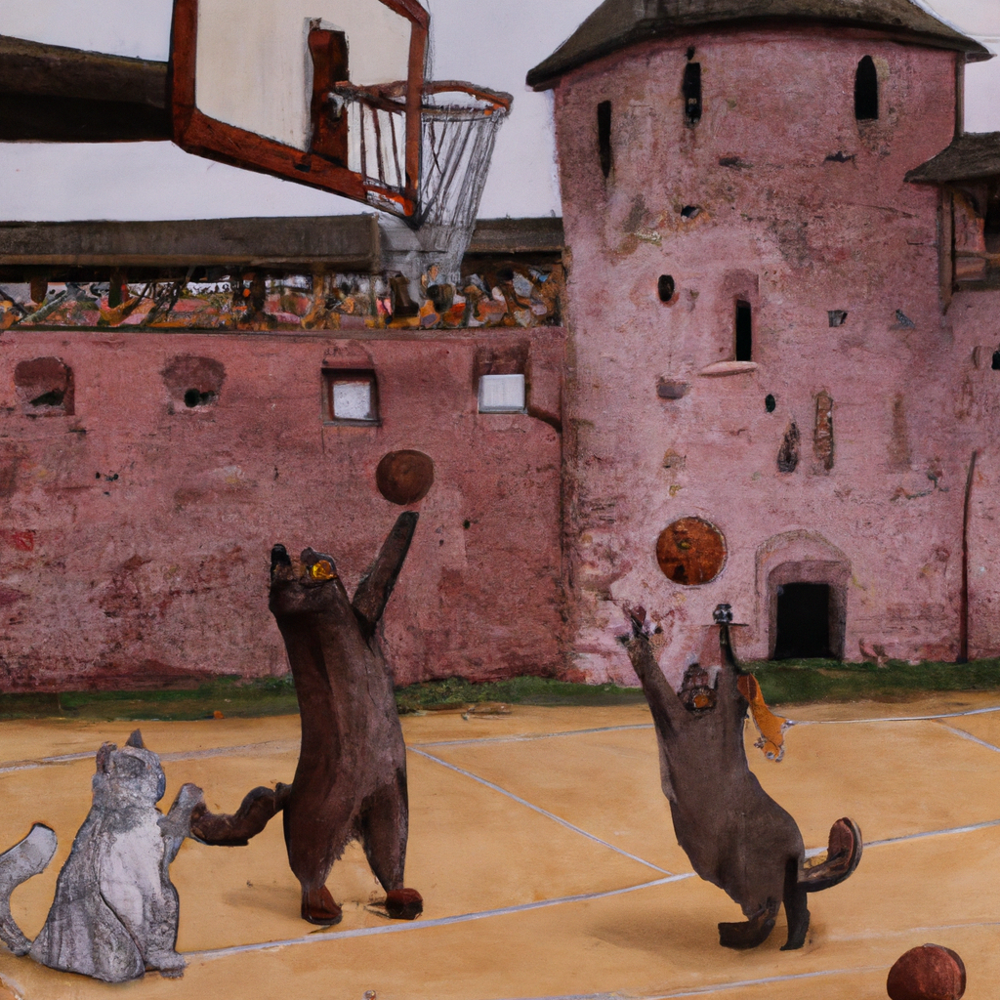

## A few examples of using OpenAI’s Image [API](https://openai.com/api/)

To test the API using this project, you should follow the next steps:

1. Create an account in [OpenAI](https://openai.com/api/)
2. Create & copy an [API key](https://beta.openai.com/account/api-keys)
3. Clone this repo → `git clone git@github.com:villivald/openai.git`
4. Run `npm i` to install the dependencies
5. Create a file called `.env` in the root of the project
6. Add the following line to the file: `API_KEY="YOUR_API_KEY_HERE"`

Run code using commands:

- `node generate.js` - to [generate](https://beta.openai.com/docs/guides/images/generations) an image with a given text prompt. Text prompt should be added to the `generate.js` file to the `prompt` variable (line 14).

- `node variation.js` - to create an image [variation](https://beta.openai.com/docs/guides/images/variations) from a given image. Image source should be added to the `variation.js` file to the `src` variable (line 15). You can add an image to the `images` folder and use it as a source. NB! According to API specs, the image should be in the `png` format, less than 3MB, and have a square aspect ratio.

- `node edit.js` - to [edit](https://beta.openai.com/docs/guides/images/edits) an image with a mask and a text prompt. Image source should be added to the `edit.js` file to the `src` variable (line 17). Mask image source should be added to the same file to the `mask` variable (line 18). You can add both images to the `images` folder. NB! According to API specs, all images should be in the `png` format, less than 3MB, and have a square aspect ratio.

Examples

`img` folder contains two examples of images generated by the API:
 - used text prompt "_Medieval cats playing basketball in Velikiy Novgorod_"
 - used text prompt "_singer Timo Soini from Finland wins the Eurovision Song Contest 2023_"
